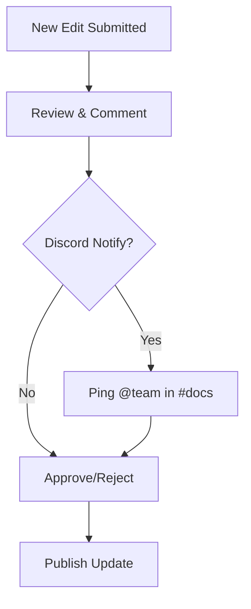

## Overview

OlympiTech provides powerful tools to create, manage, and collaborate on documentation for your Minecraft plugins. You get full wiki capabilities tailored for plugin developers, integrated seamlessly with Discord for community feedback. Build structured pages, track versions, and enable contributions without leaving your workflow.

<Columns cols={3}>
  <Card title="Wiki Management" icon="book-open" href="#wiki-management">
    Create and organize pages with rich Markdown and MDX support.
  </Card>
  <Card title="Version Control" icon="git-branch" href="#version-control">
    Track changes and release updates effortlessly.
  </Card>
  <Card title="Community Tools" icon="users" href="#community-tools">
    Enable comments, approvals, and Discord notifications.
  </Card>
</Columns>

## Wiki Management

You start by creating dedicated wiki spaces for each plugin. OlympiTech supports nested pages, tags, and search indexing to keep documentation organized.

<Steps>
  <Step title="Create a New Wiki" icon="plus">
    Navigate to your plugin dashboard and select "New Wiki". Enter a name like "EssentialsX Documentation".
  </Step>
  <Step title="Add Pages" icon="file-text">
    Use the page editor to write in MDX. Add frontmatter for metadata:
    
````yaml
---
title: Installation Guide
description: Step-by-step setup for EssentialsX
tags: ["setup", "beginner"]
---
````
  </Step>
  <Step title="Organize Structure" icon="folder">
    Drag pages into hierarchies. Create sections like `/commands`, `/configuration`, and `/faq`.
  </Step>
</Steps>

<Callout kind="tip">
  Use tags like `["setup", "advanced"]` for better search and filtering across your wiki.
</Callout>

## Version Control and Update Tracking

Maintain clean documentation histories with built-in version control. You publish updates tied to plugin releases, and readers always see the right version.

<Tabs>
  <Tab title="Plugin Changelog" icon="git-commit">
    Integrate changelogs directly into your wiki:
    
    <CodeGroup tabs="YAML,JSON">
    ````yaml
    versions:
      - version: "2.20.0"
        date: "2024-10-15"
        changes:
          - "Added `/home` command"
          - "Fixed permission bugs"
    ````
    ````json
    {
      "versions": [{
        "version": "2.20.0",
        "date": "2024-10-15",
        "changes": ["Added /home command", "Fixed permission bugs"]
      }]
    }
    ````
    </CodeGroup>
  </Tab>
  <Tab title="Rollback" icon="undo">
    Select any version from the history dropdown to view or restore older docs.
  </Tab>
</Tabs>

## Community Contribution Tools

Foster collaboration with comments, pull requests, and Discord sync. Contributors suggest edits, and you approve changes before publishing.



<ExpandableGroup>
  <Expandable title="Enable Comments" default-open="true">
    Toggle comments on any page. Users add feedback inline:
    
    > Great guide! Consider adding `/reload` permissions example.
    
    Moderate with upvote/downvote and replies.
  </Expandable>
  <Expandable title="Approval Workflows">
    Set up pull requests for major changes. Assign reviewers and require Discord approval via webhook:
    
````javascript
// Discord webhook config
webhookUrl: `https://discord.com/api/webhooks/YOUR_WEBHOOK_ID/YOUR_WEBHOOK_TOKEN`
channel: "docs-review"
````
  </Expandable>
</ExpandableGroup>

<Callout kind="success">
  Link your Discord server at `https://dashboard.example.com/integrations/discord` for real-time notifications on edits.
</Callout>

## Next Steps

<Columns cols={2}>
  <Card title="Quickstart" icon="rocket" href="/quickstart">
    Set up your first wiki in 5 minutes.
  </Card>
  <Card title="Advanced Configuration" icon="settings" href="/configuration">
    Customize workflows and permissions.
  </Card>
</Columns>