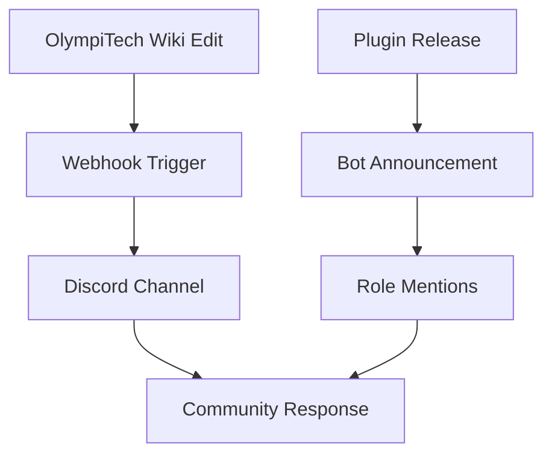

## Overview

OlympiTech enables seamless Discord integration for your Minecraft plugin wiki. Send real-time notifications for wiki edits, plugin releases, and community events directly to your Discord server. This guide covers webhook setup for updates, bot configuration for announcements, and permission management.

Use webhooks for simple push notifications and bots for interactive features like threaded discussions on plugin pages.



## Prerequisites

<Callout kind="info">

Before starting, ensure you have:

- A Discord server with admin permissions
- OlympiTech API key from your dashboard at `https://dashboard.example.com`
- A dedicated Discord channel for wiki updates

</Callout>

## Configure Discord Webhooks for Wiki Updates

Set up webhooks to notify your Discord channel whenever someone edits a Minecraft plugin wiki page.

<Steps>
  <Step title="Create Webhook" icon="settings">
    In Discord, right-click your channel, select **Integrations** > **Webhooks** > **New Webhook**.
    
    Name it `OlympiTech Updates` and copy the webhook URL.
  </Step>
  <Step title="Add Webhook to OlympiTech" icon="link">
    Log in to your OlympiTech dashboard.
    
    Navigate to **Integrations** > **Discord** and paste the webhook URL.
    
    Select events: `wiki_edit`, `plugin_update`.
  </Step>
  <Step title="Test Integration" icon="play">
    Edit a test wiki page in OlympiTech.
    
    Verify the notification appears in Discord.
  </Step>
</Steps>

Example payload sent to Discord:

<CodeGroup tabs="JavaScript,Python">
  ```javascript
  const webhookUrl = `YOUR_DISCORD_WEBHOOK_URL`;
  
  await fetch(webhookUrl, {
    method: 'POST',
    headers: { 'Content-Type': 'application/json' },
    body: JSON.stringify({
      content: '🧩 New Minecraft plugin wiki update!',
      embeds: [{
        title: 'Plugin: EssentialsX',
        description: 'Updated compatibility section.',
        url: 'https://wiki.olympitech.com/plugins/essentialsx'
      }]
    })
  });
  ```
  ```python
  import requests
  
  webhook_url = "YOUR_DISCORD_WEBHOOK_URL"
  
  data = {
      "content": "🧩 New Minecraft plugin wiki update!",
      "embeds": [{
          "title": "Plugin: EssentialsX",
          "description": "Updated compatibility section.",
          "url": "https://wiki.olympitech.com/plugins/essentialsx"
      }]
  }
  
  requests.post(webhook_url, json=data)
  ```
</CodeGroup>

## Set Up Bots for Automated Announcements

Discord bots provide richer interactions, like role pings and threaded replies for plugin discussions.

<Tabs>
  <Tab title="Node.js Bot" icon="nodejs">
    Install the Discord.js library and configure your bot token.
    
````javascript
const { Client, GatewayIntentBits } = require('discord.js');
const client = new Client({ intents: [GatewayIntentBits.Guilds] });

client.on('ready', () => {
  console.log(`OlympiTech Bot logged in as ${client.user.tag}`);
});

client.login('YOUR_BOT_TOKEN');
````

    Listen for OlympiTech webhooks on `https://api.example.com/v1/announcements`.
  </Tab>
  <Tab title="Python Bot" icon="python">
    Use discord.py for Python integration.
    
````python
import discord
from discord.ext import commands

intents = discord.Intents.default()
bot = commands.Bot(command_prefix='!', intents=intents)

@bot.event
async def on_ready():
    print(f'OlympiTech Bot logged in as {bot.user}')

bot.run('YOUR_BOT_TOKEN')
````
  </Tab>
</Tabs>

<Request tabs="cURL,JavaScript" show-lines="true">
  ```bash
  curl -X POST https://api.example.com/v1/announcements \
    -H "Authorization: Bearer YOUR_OLYMPI_API_KEY" \
    -H "Content-Type: application/json" \
    -d '{
      "type": "plugin_release",
      "plugin": "LuckPerms",
      "channel_id": "1234567890"
    }'
  ```
  ```javascript
  await fetch('https://api.example.com/v1/announcements', {
    method: 'POST',
    headers: {
      'Authorization': 'Bearer YOUR_OLYMPI_API_KEY',
      'Content-Type': 'application/json'
    },
    body: JSON.stringify({
      type: 'plugin_release',
      plugin: 'LuckPerms',
      channel_id: '1234567890'
    })
  });
  ```
</Request>

## Manage Permissions and Roles

Control who receives notifications and can interact with wiki-linked messages.

<ExpandableGroup>
  <Expandable title="Assign Roles for Wiki Editors" default-open="true">
    Create a `Wiki Editor` role in Discord.
    
    In OlympiTech dashboard, map it to `@WikiEditor` for mentions on edits.
    
    Use bot commands: `!addrole @user WikiEditor`.
  </Expandable>
  <Expandable title="Channel Permissions">
    Restrict the announcements channel to `Plugin Admins` and `Community` roles.
    
    Example bot permission check:
    
````javascript
if (!message.member.roles.cache.has('WIKI_EDITOR_ROLE_ID')) {
  return message.reply('You need Wiki Editor role to view details.');
}
````
  </Expandable>
</ExpandableGroup>

<Callout kind="tip">

Test all integrations in a staging Discord server first. Monitor webhook rate limits (30 requests per minute).

</Callout>

## Next Steps

<Columns cols={3}>
  <Card title="Advanced Bots" icon="bot" href="/advanced-bots">
    Build slash commands for wiki searches.
  </Card>
  <Card title="Other Integrations" icon="plug" href="/integrations">
    Connect with GitHub for plugin releases.
  </Card>
  <Card title="Troubleshooting" icon="help-circle" href="/troubleshooting">
    Common issues and solutions.
  </Card>
</Columns>